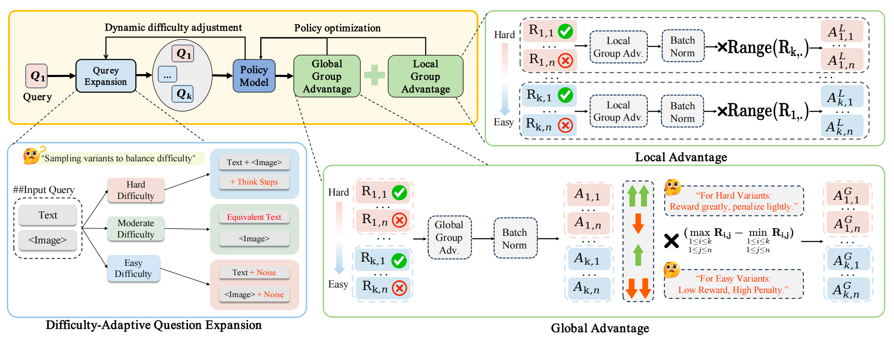

# DIVA-GRPO: Enhancing Multimodal Reasoning Through Difficulty-Adaptive Variant Advantage

<div align="center">

[](https://www.python.org/)  [](https://pytorch.org/)



*Figure: Overview of the DIVA-GRPO framework showing difficulty-adaptive question expansion and policy optimization. The method dynamically assesses problem difficulty and generates semantically consistent variants to maintain stable reward variance throughout training.*
</div>

## 🎯 Overview

DIVA-GRPO is a novel reinforcement learning framework that addresses fundamental limitations of Group Relative Policy Optimization (GRPO) in multimodal large language models (MLLMs). While GRPO enables efficient long-chain reasoning without a critic model, it suffers from **reward sparsity** (scarcity of positive feedback on difficult problems) and **advantage vanishing** (consistent rewards in overly easy/hard groups produce zero gradients).

Our difficulty-adaptive approach achieves:
- **State-of-the-art** performance among 7B models across 6 multimodal reasoning benchmarks
- **2.55× speedup** in training steps and **1.76× end-to-end speedup** in wall-clock time
- **8.23 point average improvement** over Qwen2.5-VL-7B baseline

### Core Innovations

1. **Dynamic Difficulty Assessment**: Continuously evaluates problem difficulty based on model rollout accuracy, adapting throughout training
2. **Adaptive Variant Generation**: Creates semantically consistent variants tailored to difficulty levels:
   - **Easy problems**: Add text/image perturbations to increase challenge
   - **Moderate problems**: Generate equivalent textual reformulations
   - **Hard problems**: Inject step-by-step reasoning hints to enable learning
3. **Difficulty-Weighted Scaling**: Dynamically reweights advantages to amplify signals from harder variants while stabilizing updates from easier ones
4. **Reward-Range-Based (RRB) Rescaling**: Prevents advantage inflation from minor reward differences, ensuring reliable optimization signals

Built upon the efficient [EasyR1](https://github.com/hiyouga/EasyR1) framework, DIVA-GRPO is broadly applicable to any GRPO-based training pipeline.

---

## ⚡ Quick Start

### 1. Installation

We recommend using a Conda environment. Tested on Python 3.9+ and PyTorch 2.4.0.

```bash
# Clone the repository
git clone https://github.com/your-username/DIVA-GRPO.git
cd DIVA-GRPO

# Create and activate environment
conda create -n diva_grpo python=3.9 -y
conda activate diva_grpo

# Install PyTorch (adjust for your CUDA version)
pip install torch==2.4.0 --index-url https://download.pytorch.org/whl/cu121

# Install package in editable mode
pip install -e .

# Install Flash Attention for efficiency
pip install flash-attn --no-build-isolation
```

### 2. Data Preparation

DIVA-GRPO requires datasets formatted with support for difficulty-aware variants. Use our provided augmentation script to generate variants offline using an external model (GPT-4o, Qwen-Max, etc.).

```bash
# Generate difficulty-aware variants
python verl/difficulty_variation/augment_dataset.py \
    --dataset_path data/your_original_dataset \
    --output_path data/your_augmented_dataset \
```

### 3. Training

Launch training with our reproducible scripts:

```bash
# Train DIVA-GRPO on Qwen2.5-VL-7B
# Includes: Z-score normalization, difficulty weighting (k=0.1), RRB rescaling
bash ./examples/main_exp/ZSCORENORM_WAN_RRBLOCAL_RRBGLOBAL_5000_k=0.1.sh
```

---

### Ethical Considerations

This research adheres to ethical AI principles. All data used is publicly available and does not contain sensitive personal information. The framework is designed to improve model reasoning capabilities while maintaining transparency and reproducibility.

---

## 🔗 Links

- [Project Page](https://anonymous-research.github.io/DIVA-GRPO)
- [Paper (arXiv)](https://arxiv.org/abs/2501.00000)
- [EasyR1 Framework](https://github.com/hiyouga/EasyR1)
- [VLMEvalKit](https://github.com/open-compass/VLMEvalKit) for evaluation